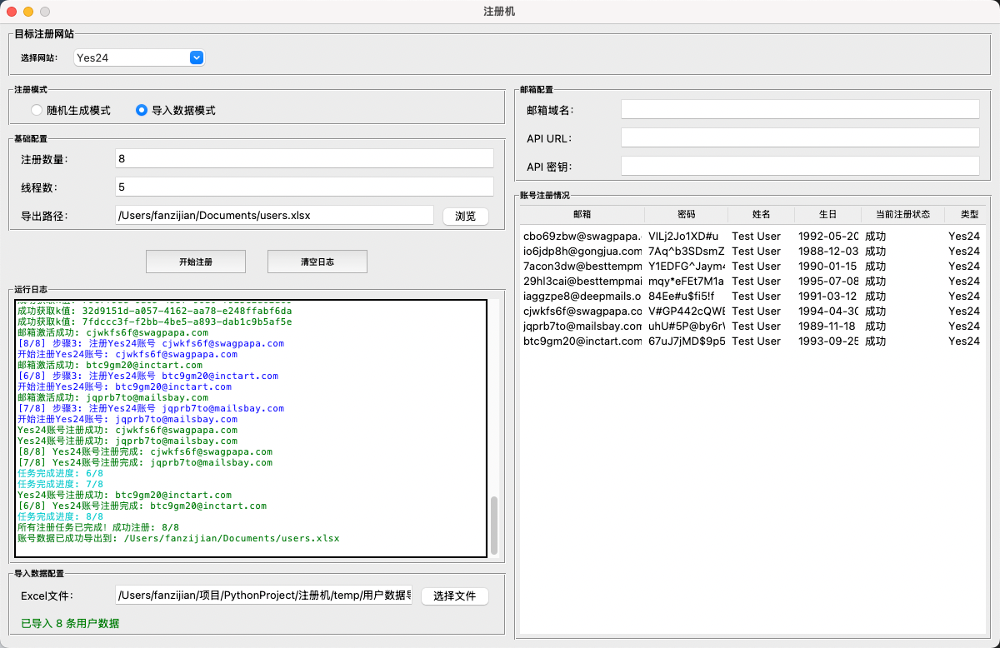

# yes24网站自动注册机

本项目为网站批量自动化注册账号的注册机，可随机大批量注册账号，也可以自定义导入用户数据进行大批量注册，

## TODO
1. 完成email_fetcher，获取邮件
2. 请查看这里，这里是我已经测试完成，确定没有问题的melon网站注册流程和注册逻辑，然后我需要你在中完成逻辑，如果有需要你可以修改优化和，你修改这两个前提是，不要影响破坏现有的yes24注册逻辑？然后melon注册只能通过导入注册模式，导入的excel表字段分别是
3. 优化yes24网站注册流程
4. 完成melon注册逻辑（melon注册只能通过导入数据,导入数据时候要使用指定模版，比yes24网站注册的导入模式的模版不通 进行注册，无法使用随机生成进行注册），根据yes24_register.py和test_melon_register_api_interactive.py去完成melon_register.py的逻辑
5. 测试yes24两种注册逻辑是否受到影响
6. 测试melon注册

## 预览
### 主要UI界面


### 随机数据注册模式演示


### 导入数据注册模式演示


### 最终导出的excel账号


### 导入数据excel模版


## 使用指南
如果需要可以进行再次拓展其他网站注册模块，需要将网站的注册相关的API进行封装，如果需要会话唯一性，根据`api/yes24_register_api.py`
中进行模仿封装，再通过继承`BaseRegisterManager`来写注册逻辑，最后在`register_factory.py`中的`RegisterManagerFactory`类进行注册。


## 用户数据导入模版生成
在本项目中有现成python脚本用于生成用户数据用于导入创建用户数据模版

### 1、生成yes24平台注册数据导入excel表格
```shell
python create_yes24_template.py
```

运行该命令后，会在根目录下创建`用户数据导入模版.xls`文件
```
用户数据导入模板已创建：/Users/fanzijian/项目/PythonProject/注册机/用户数据导入模板.xlsx
```


## 故障排除

### 常见问题

1. **邮箱验证失败**
   - 检查网络连接
   - 确认邮箱域名格式正确
   - 查看详细错误日志

2. **注册失败**
   - 确保邮箱已经通过验证
   - 检查用户信息格式是否正确
   - 验证国家代码映射

3. **导出失败**
   - 检查导出路径是否有写入权限
   - 确认目录存在
   - 检查磁盘空间

### 日志分析
系统提供彩色日志输出：
- 🔵 蓝色：信息提示
- 🟡 黄色：警告信息
- 🟢 绿色：成功操作
- 🔴 红色：错误信息

## 版本信息

- **当前版本**: 1.0.0
- **更新日期**: 2025年
- **主要特性**: 完整注册流程、会话管理、多线程支持

## 技术支持

如遇到问题，请：
1. 查看详细的错误日志
2. 运行测试脚本验证系统状态
3. 检查网络连接和目标服务器状态
4. 参考本文档的故障排除部分

---

**注意**: 请合理使用本工具，遵守相关网站的服务条款和法律法规。


